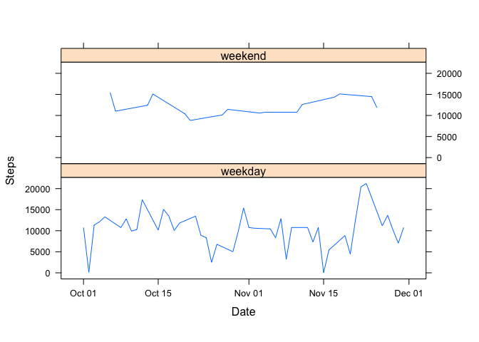

# Reproducible Research: Peer Assessment 1


## Loading and preprocessing the data
First starting by downloading the data of Activity monitoring data from [https://d396qusza40orc.cloudfront.net/repdata%2Fdata%2Factivity.zip] and unzipping on working directory. After that loading the CSV contents and removing NAs

```r
steps <- read.csv("./activity.csv", header= TRUE, sep=",", colClasses= c("numeric", "Date", "numeric"))
steps2 <- (steps[!is.na(steps['steps']),]) 
```

## What is mean total number of steps taken per day?

To calculate the means per day I had to aggregate the total steps per day.


```r
aggreagatedSteps<-aggregate(steps2$steps, by=list(steps2$date), sum) 
mean(aggreagatedSteps$x) #mean
```

```
## [1] 10766
```

```r
median(aggreagatedSteps$x) #median
```

```
## [1] 10765
```

- The meansteps per day is ```{r} mean(aggreagatedSteps$x)```
- The median of steps per day is ```{r} median(aggreagatedSteps$x)```

The plot for this example is the following:


```r
plot(y= aggreagatedSteps$x, ylab = "Steps", main = "Steps per Day", type = "h", x= aggreagatedSteps$Group.1, xlab= "Date", col="BLUE") 
```

 

## What is the average daily activity pattern?


```r
aggreagatedInterval<-aggregate(steps2$steps, by=list(steps2$interval), mean)
plot(x= aggreagatedInterval$Group.1, xlab = "Steps", main = "Avg Steps per Interval", type = "l", y= aggreagatedInterval$x, ylab= "Interval", col="BLUE")
```

 

## Imputing missing values

To reduce the impact of the ```{r} dim((steps[is.na(steps['steps']),]))[1] ``` recoirds missing values, those records received the average count for the same interval, always with a rounded value.

The following code was used:


```r
stepsFixed<-steps
for(i in 1:nrow(steps)){
  if(is.na(steps[i,'steps'])){
    stepsFixed[i,]$steps<- round(aggreagatedInterval[aggreagatedInterval$Group.1==steps[i,'interval'],'x'])
  }
}
```

For comparison those are the results:


```r
plot(y= stepsFixed$steps, ylab = "Steps", main = "Steps per Day", type = "h", x= stepsFixed$date, xlab= "Date", col="BLUE") #imprimindo histogram
```

 

```r
mean(stepsFixed$steps) #mean
```

```
## [1] 37.38
```

```r
median(stepsFixed$steps) #median
```

```
## [1] 0
```

## Are there differences in activity patterns between weekdays and weekends?

To better understand the differences in reading for weekdays and weekends a panel plot was deisgined.
First step was to create a new aggregated data with no missing values:


```r
aggregatedFixed<-aggregate(stepsFixed$steps, by=list(stepsFixed$date), sum) #total de passos por dia
```
After that filled a new column with the information if the reading was made on a weekday or weekend:


```r
aggregatedFixed$day<-ifelse(as.POSIXlt(aggregatedFixed$Group.1)$wday%%6==0,"weekend","weekday")
```

Creating a factor and a new aggregate for the final plotting:

```r
aggregatedFixed$day<-factor(aggregatedFixed$day,levels=c("weekday","weekend"))
aggregatedIntervalF<-aggregate(x~Group.1+day,aggregatedFixed,mean)
```

And for the final plot lattice makes easier to create them based on the factors:

```r
library(lattice)
xyplot(x~Group.1|factor(day),data=aggregatedIntervalF,aspect="xy",type="l", xlab = 'Date', ylab='Steps')
```

 
